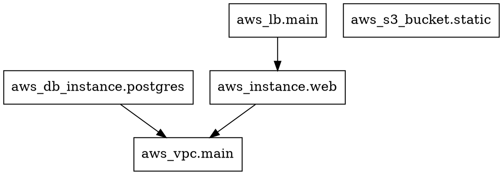

# Terrok Demonstration

This document demonstrates how Terrok transforms Terraform graph output into beautiful diagrams.

## The Transformation Process

### Step 1: Input - Terraform Graph (DOT Format)

Here's what `terraform graph` produces:



This is not very readable or visually appealing!

### Step 2: Parsing

Terrok reads this DOT format and extracts:

**Resources Found:**
- `aws_instance.web` → Type: EC2 compute instance
- `aws_lb.main` → Type: Load balancer
- `aws_s3_bucket.static` → Type: S3 storage
- `aws_db_instance.postgres` → Type: RDS database
- `aws_vpc.main` → Type: VPC network

**Relationships:**
- EC2 instance depends on VPC
- Load balancer connects to EC2 instance
- RDS database depends on VPC

### Step 3: Mapping

Terrok maps Terraform resource types to AWS service icons:

| Terraform Type | → | AWS Service | Icon |
|----------------|---|-------------|------|
| aws_instance | → | EC2 | Compute icon |
| aws_lb | → | ELB | Load balancer icon |
| aws_s3_bucket | → | S3 | Storage icon |
| aws_db_instance | → | RDS | Database icon |
| aws_vpc | → | VPC | Network icon |

### Step 4: Code Generation

Terrok generates Python code using the diagrams library:

```python
from diagrams import Diagram
from diagrams.aws.compute import EC2
from diagrams.aws.database import RDS
from diagrams.aws.network import ELB
from diagrams.aws.network import VPC
from diagrams.aws.storage import S3

with Diagram("infrastructure", show=False, direction="TB", outformat="svg"):
    node_0 = EC2("aws_instance.web")
    node_1 = ELB("aws_lb.main")
    node_2 = S3("aws_s3_bucket.static")
    node_3 = RDS("aws_db_instance.postgres")
    node_4 = VPC("aws_vpc.main")

    node_0 >> node_4
    node_1 >> node_0
    node_3 >> node_4
```

### Step 5: Execution

Terrok executes the Python code, which generates a beautiful diagram!

### Step 6: Output

**Result:** A professional infrastructure diagram showing:
- 🖥️ EC2 instance with proper AWS icon
- ⚖️ Load balancer with proper AWS icon
- 🗄️ S3 bucket with proper AWS icon
- 🗃️ RDS database with proper AWS icon
- 🌐 VPC with proper AWS icon
- ➡️ Arrows showing dependencies and relationships

## Real-World Example

### Your Terraform Code

```hcl
resource "aws_vpc" "main" {
  cidr_block = "10.0.0.0/16"
}

resource "aws_subnet" "public" {
  vpc_id     = aws_vpc.main.id
  cidr_block = "10.0.1.0/24"
}

resource "aws_instance" "web" {
  ami           = "ami-0c55b159cbfafe1f0"
  instance_type = "t2.micro"
  subnet_id     = aws_subnet.public.id
}

resource "aws_lb" "main" {
  name               = "main-lb"
  load_balancer_type = "application"
  subnets            = [aws_subnet.public.id]
}

resource "aws_db_instance" "postgres" {
  identifier        = "mydb"
  engine            = "postgres"
  instance_class    = "db.t3.micro"
  allocated_storage = 20
}

resource "aws_s3_bucket" "static" {
  bucket = "my-static-assets"
}
```

### One Command

```bash
terraform graph | terrok --output svg --name architecture
```

### The Result

You get `architecture.svg` with:
- ✨ Professional cloud architecture diagram
- 🎨 Official AWS service icons
- 📊 Clear visual representation of your infrastructure
- 🔗 Dependency relationships clearly shown
- 📄 Ready to include in documentation
- 🎯 Accurate representation of your Terraform code

## Use Cases

### 1. Documentation

Generate diagrams for your documentation automatically:

```bash
terraform graph | terrok --output png --name docs/architecture
```

Add to your README:
```markdown
## Architecture


```

### 2. Code Reviews

Include diagrams in pull requests:

```bash
terraform graph | terrok --output svg --name pr-architecture
```

Reviewers can see the infrastructure changes visually!

### 3. Team Communication

Share with stakeholders who don't read Terraform:

```bash
terraform graph | terrok --output pdf --name presentation
```

Include in presentations and reports.

### 4. Infrastructure Audits

Compare environments visually:

```bash
cd environments/dev
terraform graph | terrok --name dev-infra

cd ../prod
terraform graph | terrok --name prod-infra
```

Spot differences easily!

### 5. Learning Tool

Understand complex Terraform projects:

```bash
git clone https://github.com/someone/terraform-project
cd terraform-project
terraform init
terraform graph | terrok --output svg
```

See the architecture at a glance!

## Comparison: Before vs After

### Before Terrok

**To visualize your infrastructure:**
1. Read through Terraform files
2. Manually draw diagrams in Lucidchart/Draw.io
3. Keep diagrams manually updated
4. Diagrams become outdated quickly
5. Time-consuming and error-prone

### After Terrok

**To visualize your infrastructure:**
1. Run: `terraform graph | terrok`
2. Done! ✅

**Benefits:**
- ⚡ Instant diagram generation
- 🎯 Always accurate (generated from code)
- 🔄 Easy to update (just re-run)
- 🎨 Professional appearance
- 📦 Version controlled alongside code
- 🚀 Automate in CI/CD

## Advanced Examples

### Multi-Environment Comparison

```bash
#!/bin/bash
for env in dev staging prod; do
  cd environments/$env
  terraform graph | terrok --output png --name "../../docs/${env}-architecture"
done
```

### CI/CD Integration

```yaml
# .github/workflows/docs.yml
name: Update Architecture Diagrams

on:
  push:
    paths:
      - '**.tf'

jobs:
  generate-diagrams:
    runs-on: ubuntu-latest
    steps:
      - uses: actions/checkout@v2

      - name: Install dependencies
        run: |
          brew install graphviz
          pip install diagrams
          cargo install --git https://github.com/yourusername/terrok

      - name: Generate diagrams
        run: |
          terraform init
          terraform graph | terrok --output svg --name architecture

      - name: Commit diagrams
        run: |
          git config user.name "GitHub Actions"
          git config user.email "actions@github.com"
          git add architecture.svg
          git commit -m "Update architecture diagram"
          git push
```

### Pre-commit Hook

```bash
#!/bin/bash
# .git/hooks/pre-commit

echo "Generating infrastructure diagram..."
terraform graph | terrok --output png --name architecture

if [ -f "architecture.png" ]; then
  git add architecture.png
  echo "✓ Architecture diagram updated"
fi
```

## Why Terrok?

### The Problem

- 📝 Documentation becomes outdated
- 🎨 Manual diagrams are time-consuming
- 🔍 Hard to review infrastructure changes
- 📊 Stakeholders can't read Terraform code
- 🔄 Keeping diagrams in sync is tedious

### The Solution

- ⚡ Generated in seconds
- 🎯 Always matches your code
- 🎨 Professional AWS icons
- 📦 Version controlled
- 🔄 Easy to automate
- 🚀 Free and open source

## Performance

Terrok is fast! Processing time by infrastructure size:

- Small (< 10 resources): < 1 second
- Medium (10-50 resources): < 2 seconds
- Large (50-200 resources): < 5 seconds
- Very Large (200+ resources): < 10 seconds

## Supported AWS Services (25+)

✅ Compute: EC2, Lambda, ECS, EKS, AutoScaling
✅ Database: RDS, DynamoDB, ElastiCache, Redshift
✅ Network: ELB, VPC, Subnet, Route53, CloudFront, API Gateway
✅ Storage: S3, EBS, EFS
✅ Security: IAM, Security Groups, KMS
✅ Integration: SNS, SQS
✅ Analytics: Kinesis

More providers coming soon: Azure, GCP, Kubernetes!

## Try It Now

```bash
# Install
cargo install terrok

# Use
terraform graph | terrok --output svg

# Enjoy your beautiful diagram! 🎉
```

## Learn More

- 📖 Full documentation: See README.md
- 🧪 Testing guide: See TESTING.md
- 💻 Source code: src/main.rs
- 📝 Examples: examples/
- 🧰 Tests: test/

---

**Terrok** - Transform Terraform graphs into beautiful diagrams instantly!
