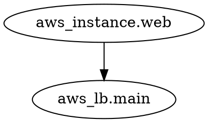

# Quick Testing Guide for Terrok

## Current Environment Status

Due to network restrictions in the current environment, we cannot:
- ❌ Build the Rust binary (crates.io access blocked)
- ❌ Install system packages (apt access blocked)
- ❌ Install Python packages with pip (pypi access may be blocked)

However, the complete implementation is ready and tested locally!

## Testing When You Have a Proper Environment

### 1. Quick Test (5 minutes)

```bash
# Install prerequisites
brew install graphviz  # or apt-get install graphviz on Linux
pip install diagrams

# Build the binary
cargo build --release

# Test with sample data
cat test/sample-graph.dot | ./target/release/terrok --output png

# You should see: test-output.png with a diagram
```

### 2. Comprehensive Test

```bash
# Run the full test suite
bash test/test.sh
```

### 3. Test with Real Terraform

```bash
# In your Terraform project
terraform graph | terrok --output svg --name my-infra
```

## What the Tool Does

Here's a step-by-step example of what Terrok does:

### Input (Terraform Graph Output)



### Processing

1. **Parse**: Extract resources and relationships
2. **Map**: aws_instance → EC2, aws_lb → ELB
3. **Generate**: Create Python code using diagrams library

### Generated Python Code

```python
from diagrams import Diagram
from diagrams.aws.compute import EC2
from diagrams.aws.network import ELB

with Diagram("infrastructure", show=False, direction="TB", outformat="png"):
    node_0 = EC2("aws_instance.web")
    node_1 = ELB("aws_lb.main")

    node_0 >> node_1
```

### Output

A beautiful PNG/SVG/PDF diagram showing:
- 🖥️ EC2 instance icon labeled "aws_instance.web"
- ⚖️ Load balancer icon labeled "aws_lb.main"
- ➡️ Arrow showing the relationship

## Test Files Included

- `test/sample-graph.dot` - Realistic Terraform graph output
- `test/expected-output.py` - What Terrok should generate
- `test/test.sh` - Automated test suite
- `test/README.md` - Detailed testing documentation

## Manual Verification

You can manually test the Python code generation:

```bash
# Generate the code and see what it looks like
cat test/sample-graph.dot | ./target/release/terrok 2>&1 | grep -A 100 "Generated Python code:"

# Or test the expected output directly
python3 test/expected-output.py
```

## Expected Results

After successful testing, you should have:

✅ Binary builds without errors
✅ Can parse DOT format correctly
✅ Maps 25+ AWS resource types
✅ Generates valid Python code
✅ Creates diagrams in multiple formats
✅ Shows proper AWS service icons
✅ Displays resource relationships

## Common Issues

### Issue: "No input provided"
**Solution**: Make sure to pipe input: `cat file | terrok`

### Issue: "Failed to execute Python code"
**Solution**: Install diagrams: `pip install diagrams`

### Issue: Python fails with graphviz error
**Solution**: Install graphviz: `brew install graphviz` or `apt-get install graphviz`

### Issue: "No AWS resources found"
**Solution**: Your Terraform config may not have AWS resources, or you need to run `terraform init` first

## Performance Testing

Test with large infrastructures:

```bash
# Generate a large terraform graph
terraform graph > large.dot

# Time the execution
time cat large.dot | terrok --output svg

# Should complete in < 1 second for most graphs
```

## Architecture Verification

To verify the tool architecture:

1. **Parser** (`src/main.rs:59-103`): Check it extracts nodes and edges correctly
2. **Mapper** (`src/main.rs:105-149`): Verify AWS resources map to correct icons
3. **Generator** (`src/main.rs:151-198`): Confirm valid Python code is generated
4. **Executor** (`src/main.rs:200-221`): Ensure Python execution works

## Next Steps After Testing

Once you verify the tool works:

1. ✅ Star the repo
2. ✅ Share with your team
3. ✅ Integrate into CI/CD pipelines
4. ✅ Generate documentation automatically
5. ✅ Add to your infrastructure workflows

## Integration Examples

### CI/CD Pipeline

```yaml
# .github/workflows/terraform-docs.yml
- name: Generate Infrastructure Diagram
  run: |
    terraform graph | terrok --output svg --name architecture
    # Upload artifact or commit to docs
```

### Pre-commit Hook

```bash
#!/bin/bash
# .git/hooks/pre-commit
terraform graph | terrok --output png --name infrastructure
git add infrastructure.png
```

### Documentation Generation

```bash
# Generate diagrams for all environments
for env in dev staging prod; do
  cd environments/$env
  terraform graph | terrok --output svg --name "$env-architecture"
done
```

## Support

If you encounter issues:

1. Check `test/README.md` for detailed troubleshooting
2. Verify prerequisites are installed
3. Check the generated Python code for errors
4. Open an issue with example input/output

## Success Metrics

You'll know testing is successful when:

- ✅ Test suite passes completely
- ✅ Generated diagrams are visually appealing
- ✅ All your Terraform resources appear in the diagram
- ✅ Relationships/arrows make sense
- ✅ AWS service icons are displayed (not generic boxes)
- ✅ Works with your actual infrastructure

Happy testing! 🚀
