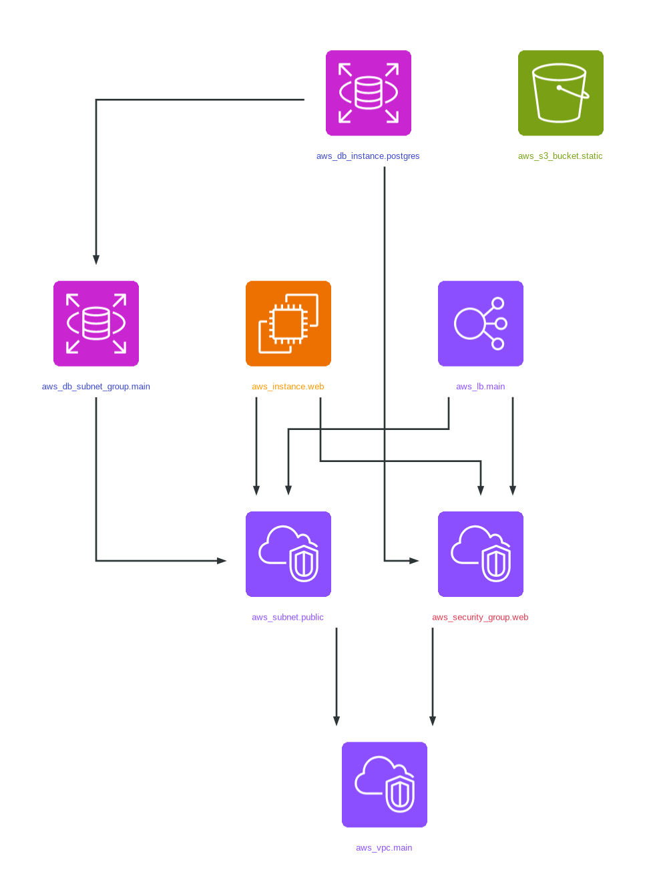
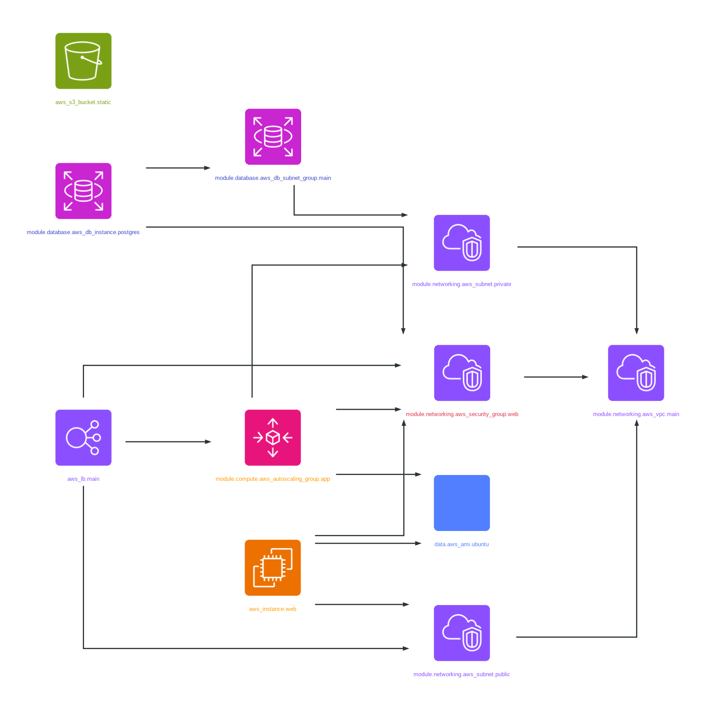

# Sample Diagrams

This directory contains sample infrastructure diagrams generated by Agedashi from test data, showcasing different layout directions and output formats.

## Top-to-Bottom Layout (Default)

The default vertical layout, ideal for hierarchical infrastructure views:

- **PNG**: [sample-infrastructure-tb.png](sample-infrastructure-tb.png)
- **SVG**: [sample-infrastructure-tb.svg](sample-infrastructure-tb.svg)
- **PDF**: [sample-infrastructure-tb.pdf](sample-infrastructure-tb.pdf)



## Left-to-Right Layout

Horizontal layout, great for wide displays and presentations:

- **PNG**: [sample-infrastructure-lr.png](sample-infrastructure-lr.png)
- **SVG**: [sample-infrastructure-lr.svg](sample-infrastructure-lr.svg)
- **PDF**: [sample-infrastructure-lr.pdf](sample-infrastructure-lr.pdf)



## How They're Generated

These diagrams are automatically generated by the GitHub Actions workflow from `test/sample-graph.dot` using:

```bash
# Top-to-Bottom
cat test/sample-graph.dot | agedashi --direction TB --output <format> --name sample-infrastructure-tb

# Left-to-Right
cat test/sample-graph.dot | agedashi --direction LR --output <format> --name sample-infrastructure-lr
```

The samples showcase Agedashi's ability to visualize Terraform/OpenTofu infrastructure with official AWS Architecture Icons, rounded corners, transparent backgrounds, and clean layouts.
