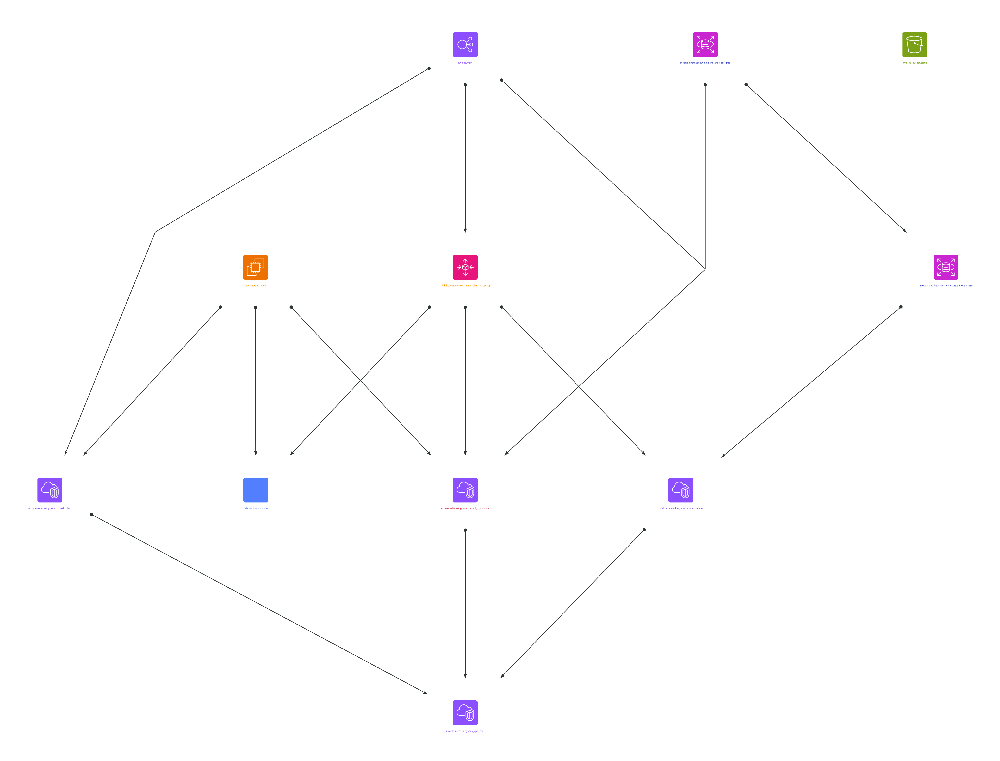

# Sample Infrastructure Diagrams

This directory contains sample infrastructure diagrams generated by Agedashi, showcasing different edge routing modes and layout directions.

## Edge Routing Modes

Agedashi now supports multiple edge routing algorithms, each optimized for different visualization needs:

### 🌊 Curved (`--edge-routing curved`)
Smooth curved edges with node avoidance. Best for general-purpose diagrams where visual flow is important.

**Features:**
- Smooth bezier curves
- Node overlap prevention (`sep="+15,15"`, `esep="+12,12"`)
- Moderate spacing: `nodesep=1.2`, `ranksep=1.8`
- Easy to follow visual flow

**Samples:** `sample-curved-tb.png`, `sample-curved-lr.png`

---

### 📐 Orthogonal (`--edge-routing ortho`)
Horizontal and vertical routing only. Clean, technical appearance with 90° angles.

**Features:**
- Axis-aligned edges (horizontal/vertical only)
- Overlap handling with `overlap=scalexy`
- Good spacing: `nodesep=1.5`, `ranksep=2.0`
- Professional technical diagram style

**Samples:** `sample-ortho-tb.png`, `sample-ortho-lr.png`

---

### 🔌 Trace (`--edge-routing trace`) ⭐ **NEW**
Circuit board PCB style with strict spacing tolerances. Mimics hardware trace routing.

**Features:**
- Orthogonal routing with enhanced spacing
- Strict trace-to-trace clearance (`sep="+25,25"`, `esep="+20,20"`)
- Maximum spacing: `nodesep=2.0`, `ranksep=2.5`
- Mimics PCB trace routing conventions
- No edge-node overlaps guaranteed
- Best for circuit diagrams and hardware-style visualizations

**Samples:** `sample-trace-tb.png`, `sample-trace-lr.png`



---

### 📏 Polyline (`--edge-routing polyline`)
Straight line segments with angled connections.

**Features:**
- Straight edges with varying angles
- Node avoidance (`sep="+10,10"`)
- Moderate spacing: `nodesep=1.2`, `ranksep=1.8`
- Minimalist, direct routing

**Samples:** `sample-polyline-tb.png`, `sample-polyline-lr.png`

---

## Layout Directions

All routing modes support two layout directions:

- **TB** (Top-to-Bottom): Vertical hierarchical layout
- **LR** (Left-to-Right): Horizontal hierarchical layout

## Connection Style Improvements

All diagrams feature enhanced connection visualization:

- **Compass point ports**: Edges connect to consistent node center positions
- **Circuit-style endpoints**: Hybrid connection style with dots at source, arrows at target
- **Node avoidance**: Enhanced spacing prevents edges from overlapping nodes
- **Clear directionality**: Easy to trace data flow and dependencies

## Choosing a Routing Mode

| Use Case | Recommended Mode |
|----------|------------------|
| General cloud architecture | `curved` |
| Technical system diagrams | `ortho` |
| Hardware/circuit designs | `trace` |
| Simple dependency graphs | `polyline` |
| Maximum clarity & spacing | `trace` |
| Aesthetic visual flow | `curved` |

## Generating Samples

To regenerate all sample diagrams with all routing modes:

```bash
./generate-samples.sh
```

This script generates a matrix of all routing modes × layout directions, creating both PNG and SVG outputs.

Manual generation:

```bash
# Trace routing, top-to-bottom
cat test/sample-graph.dot | agedashi \
  --direction TB \
  --edge-routing trace \
  --output png \
  --name sample-trace-tb

# Curved routing, left-to-right
cat test/sample-graph.dot | agedashi \
  --direction LR \
  --edge-routing curved \
  --output svg \
  --name sample-curved-lr
```

## Available Files

### New Routing Mode Samples
- `sample-curved-{tb,lr}.{png,svg}` - Curved routing
- `sample-ortho-{tb,lr}.{png,svg}` - Orthogonal routing
- `sample-trace-{tb,lr}.{png,svg}` - Circuit trace routing
- `sample-polyline-{tb,lr}.{png,svg}` - Polyline routing

### Legacy Samples
- `sample-infrastructure-{tb,lr}.{png,svg,pdf}` - Original samples (equivalent to curved mode)

## Technical Details

The edge routing improvements include:

1. **Node Overlap Avoidance**: Using GraphViz `sep` and `esep` attributes
2. **Optimized Spacing**: Each mode has tuned `nodesep` and `ranksep` values
3. **Trace Tolerances**: Circuit mode maintains strict spacing like PCB manufacturing
4. **Consistent Connections**: Compass points ensure edges meet nodes at predictable locations
